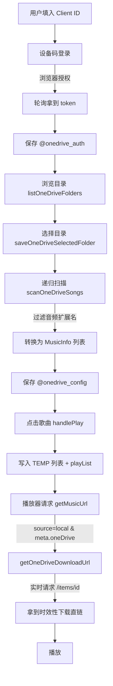

# OneDrive 远程播放实现分析

> 对应版本:1.8.84 pre-release4 / 1.8.85
> 功能入口:首页导航「OneDrive」(`nav_onedrive`)

## 一、功能概述

该功能让用户登录自己的 Microsoft 账号,扫描 OneDrive 网盘中的音频文件,并把它们当作「本地歌曲」直接在 App 内在线播放。核心思路是:**把 OneDrive 歌曲伪装成 `source: 'local'` 的特殊类型**,通过 `meta.oneDrive` 标记与真正的本地歌曲区分,从而最大限度复用现有的播放器、列表、歌词体系,几乎不侵入原有播放主流程。

## 二、模块结构

| 文件 | 行数 | 职责 |
|------|------|------|
| `src/core/oneDrive/auth.ts` | 245 | OAuth 2.0 鉴权:设备码流、授权码流(PKCE)、token 刷新、账户信息 |
| `src/core/oneDrive/drive.ts` | 204 | Microsoft Graph API:目录浏览、递归扫描、文件转换、配置存储、播放地址获取 |
| `src/core/oneDrive/music.ts` | 62 | 播放适配层:实现 `getMusicUrl` / `getPicUrl` / `getLyricInfo` 三个标准接口 |
| `src/core/oneDrive/utils.ts` | 7 | `isOneDriveMusicInfo()` 判断一首歌是否来自 OneDrive |
| `src/types/onedrive.d.ts` | 83 | `LX.OneDrive` 命名空间下的全部类型定义 |
| `src/screens/Home/Views/OneDrive/index.tsx` | 799 | UI:登录配置页(config) + 歌曲列表页(list) |

集成点:

- `src/core/music/index.ts` —— 播放/封面/歌词的源路由分发
- `src/event/appEvent.ts` —— 底部播放栏「跳转到正在播放」时定位 OneDrive 歌曲
- `src/core/init/player/playHistory.ts` —— 把 OneDrive 歌曲排除出播放历史
- `src/config/constant.ts` / `src/config/defaultSetting.ts` —— 注册导航项,默认开启

## 三、整体数据流



## 四、鉴权实现(auth.ts)

### 4.1 关键常量

```
AUTHORITY    = https://login.microsoftonline.com/common/oauth2/v2.0
GRAPH_ME_URL = https://graph.microsoft.com/v1.0/me
REDIRECT_URI = https://login.microsoftonline.com/common/oauth2/nativeclient
SCOPES       = offline_access User.Read Files.Read
```

使用 `common` 端点,支持个人 Microsoft 账户 + 组织账户。权限只申请只读(`Files.Read`)与刷新(`offline_access`)。

### 4.2 设备码登录(UI 实际采用)

适合移动端,无需配置回调地址,流程见 `auth.ts:102-164`:

1. `createOneDriveDeviceCode(clientId)` —— POST `/devicecode`,拿到 `user_code` + `verification_uri`,计算 `expiresAt`、`interval`。
2. UI 打开浏览器让用户输入 `user_code` 完成授权(`index.tsx:191-216`)。
3. `pollOneDriveDeviceCode()` —— 按 `interval` 轮询 `/token`:
   - 遇到 `authorization_pending`:继续等待;
   - 遇到 `slow_down`:间隔 +5 秒;
   - 成功:组装 `AuthInfo` 并 `saveOneDriveAuth` 持久化;
   - 超过 `expiresAt`:抛「设备码已过期」。

### 4.3 授权码登录(代码已实现,UI 未接入)

`createOneDriveAuthUrl()` / `exchangeOneDriveCode()`(`auth.ts:166-217`)实现了授权码 + PKCE 流程,把 `code_verifier`、`state` 暂存于 `@onedrive_pending_auth`,授权后用 code 换 token。**注意:`code_challenge_method` 使用的是 `plain`(直接把 verifier 当 challenge),并非更安全的 `S256`。** 这条链路目前 UI 没有调用,属于备用实现。

### 4.4 Token 持久化与自动刷新

- 存储键 `@onedrive_auth`,结构为 `AuthInfo { clientId, accessToken, refreshToken, expiresAt, account }`。
- `getValidOneDriveAuth()`(`auth.ts:240-245`)是对外统一入口:若 `accessToken` 距过期 **不足 5 分钟**,自动用 `refresh_token` 调 `refreshOneDriveAuth()` 续期;刷新返回的新 refresh_token 若为空则沿用旧值。
- 所有 Graph 请求都先经过该函数,因此调用方无需关心 token 时效。

## 五、目录浏览与扫描(drive.ts)

### 5.1 Graph 请求封装

- `requestGraph<T>()`(`drive.ts:19-31`):统一附带 `Bearer` token,解析错误信息。
- `readAllPages<T>()`(`drive.ts:33-42`):自动跟随 `@odata.nextLink` 翻页,直到取完。
- `getChildrenUrl()`:请求 `/items/{id}/children` 或 `/root/children`,带 `$expand=thumbnails(small,medium,large)` 一次性取缩略图,`$top=200` 控制单页量。

### 5.2 目录浏览

`listOneDriveFolders()`(`drive.ts:93-106`)只保留 `folder` 类型条目并按名称排序,供 UI 逐级下钻浏览。UI 用 `folderStack` 维护层级,支持「返回上级 / 选择当前目录 / 扫描已选目录」。

### 5.3 递归扫描

`scanFolder()`(`drive.ts:153-179`)深度优先递归遍历所选目录:

- 子目录:递归进入,通过 `onProgress(count, path)` 实时回传进度;
- 文件:仅保留扩展名在白名单内的音频(`mp3/flac/wav/m4a/aac/ogg/oga/opus/wma/ape`)。

`scanOneDriveSongs()` 扫描完成后按 `lastModifiedTime` **倒序**(最新在前)排序,连同 `selectedFolder`、`scannedAt` 一起存入 `@onedrive_config`。

> UI 对「未选目录直接扫根目录」做了二次确认提示(`index.tsx:280-290`),因为根目录递归会产生大量请求,可能触发微软限流。

### 5.4 文件 → 歌曲转换

`toMusicInfo()`(`drive.ts:115-142`)是关键转换:

```
id     = onedrive_<itemId>
source = local                ← 复用本地源体系的核心
meta = {
  oneDrive: true,             ← 区分真本地文件的标记
  itemId, fileName, filePath, ext, size,
  downloadUrl,                ← @microsoft.graph.downloadUrl(时效直链)
  picUrl,                     ← 缩略图(large > medium > small)
  lastModifiedTime,
}
```

歌名/歌手解析(`parseFileName`,`drive.ts:60-69`):以文件名中第一个 `-` 切分,左侧为歌名、右侧为歌手(如 `周杰伦 - 晴天`)。

## 六、播放接入机制(核心)

### 6.1 源路由分发

`src/core/music/index.ts` 是所有歌曲获取播放地址/封面/歌词的总入口。判断逻辑(以 `getMusicUrl` 为例,`index.ts:35-45`):

```
if ('progress' in musicInfo)        → 下载歌曲
else if (source == 'local')
    if ('oneDrive' in meta)         → OneDrive 分支 ★
    else                            → 普通本地文件
else                                → 在线歌曲
```

`getPicPath`、`getLyricInfo` 采用完全相同的三层判断。这意味着 OneDrive 复用了 local 源的所有判断路径,只在 `meta.oneDrive` 处分流。

### 6.2 三个适配接口(music.ts)

| 接口 | 实现 |
|------|------|
| `getMusicUrl` | 调 `getOneDriveDownloadUrl()` **实时**重新请求 `/items/{itemId}` 拿最新直链 |
| `getPicUrl` | 直接返回扫描时缓存的 `meta.picUrl` 缩略图 |
| `getLyricInfo` | 本地无歌词 → 走「其他在线源」按歌名歌手匹配歌词并缓存 |

### 6.3 为什么播放地址要实时获取

OneDrive 的 `@microsoft.graph.downloadUrl` 是带签名、有时效的预签名 URL,扫描时缓存的那个很可能在播放时已失效。因此 `getOneDriveDownloadUrl()`(`drive.ts:196-204`)每次播放都重新请求该文件的最新直链,并回写 `meta.downloadUrl`。

## 七、播放触发流程(UI)

点击歌曲 `handlePlay`(`index.tsx:294-303`):

```
overwriteListMusics(LIST_IDS.TEMP, songs)   把整个扫描列表写入「临时列表」
  → playList(LIST_IDS.TEMP, index)          从点击位置开始播放
```

这样 OneDrive 列表完全借用 App 既有的临时列表 + 播放器机制,无需独立播放队列。

## 八、导航与「跳转到正在播放」

- 导航项 `{ id: 'nav_onedrive', icon: 'svg:onedrive' }`(`constant.ts:120`),默认开启(`defaultSetting.ts:29`)。
- 点击底部播放栏跳转时,`appEvent.jumpListPosition()`(`appEvent.ts:186-198`)先判断当前歌曲是否 OneDrive:若是,切到 `nav_onedrive` 页并 `emit('jumpOneDrivePosition')`。
- OneDrive 页监听该事件(`index.tsx:326-345`),`scrollToMusic` 滚动定位到当前播放歌曲;若当时处于搜索态会先清空搜索再定位。

## 九、数据存储一览

| 存储键 | 内容 |
|--------|------|
| `@onedrive_auth` | `AuthInfo`:clientId、access/refresh token、过期时间、账户信息 |
| `@onedrive_pending_auth` | 授权码流临时态(codeVerifier、state),仅备用链路使用 |
| `@onedrive_config` | `Config`:已选目录、扫描出的歌曲列表、扫描时间 |

均通过 `@/plugins/storage` 的 `getData/saveData/removeData` 读写。

## 十、关键设计点小结

1. **以 local 源为载体的最小侵入设计**:OneDrive 歌曲 `source='local'` + `meta.oneDrive=true`,只在 `core/music/index.ts` 三处加一层 `if` 即完成全功能接入。
2. **时效直链实时刷新**:规避预签名 URL 过期导致的播放失败。
3. **设备码登录为主**:移动端无需回调地址,体验顺畅;授权码 + PKCE 作为备用实现。
4. **Token 提前 5 分钟自动续期**,上层无感。
5. **歌词二次兜底**:本地无内嵌歌词时,自动按歌名歌手去在线源匹配。
6. **借用 TEMP 临时列表**播放,不另建队列。

## 十一、注意事项与可改进点

- **PKCE 使用 `plain` 而非 `S256`**:授权码流安全性偏弱(目前 UI 未启用)。
- **授权码流是死代码**:`createOneDriveAuthUrl` / `exchangeOneDriveCode` 已实现但无 UI 入口,可考虑接入或移除。
- **OneDrive 歌曲不计入播放历史**:`playHistory.ts:24-27` 显式排除,若需统计需另行处理。
- **封面缩略图也可能有时效**:`picUrl` 在扫描时缓存且 `cache={false}`,长期未重扫可能失效。
- **根目录扫描限流风险**:已有确认提示,但大网盘仍建议精确选目录。
- **歌名歌手依赖文件命名规范**:仅按首个 `-` 切分,命名不规范时解析不准。
